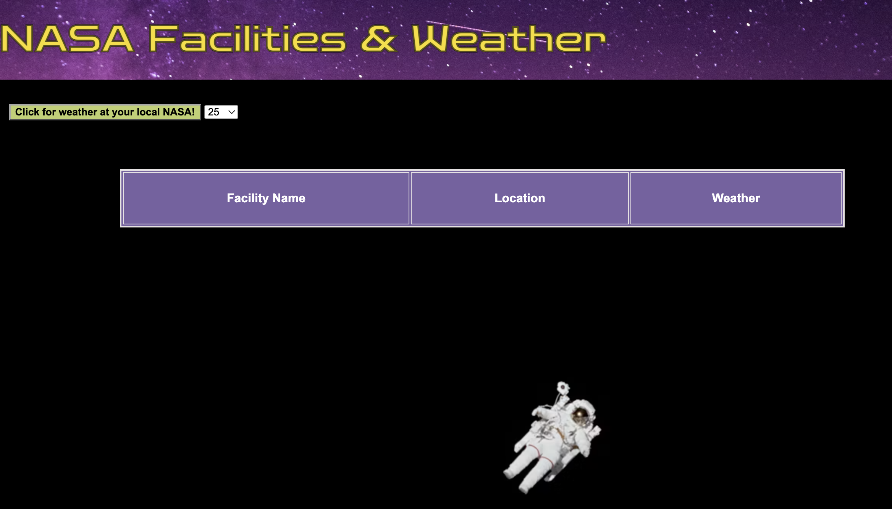

# 🚀 Project: Complex NASA API

### Goal: Use NASA's API to return all of their facility locations (~400). Display the name of the facility, its location, and the weather at the facility currently. 

### Project: After pressing the button, view all ~400 NASA facilities and the weather. Use the NASA facilities API to print all facilities to the DOM. Use a weather app api to print the weather for each respective facility.

